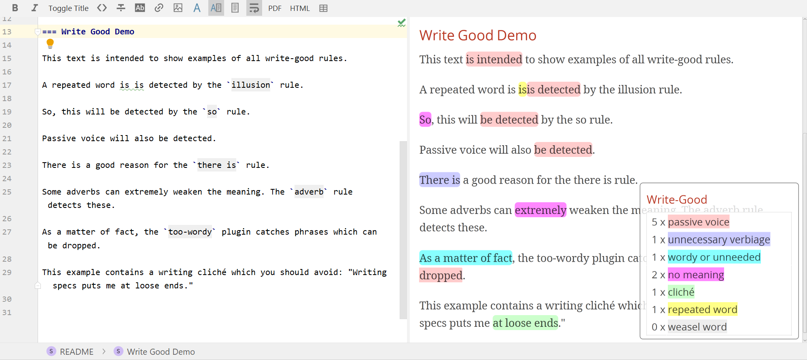

== write-good-asciidoc

https://github.com/btford/write-good[Write-Good] is a "`naive linter for English prose`".
It helps with its checks to write better prose by highlighting bad style.

This project applies the write-good rules to AsciiDoc via the AsciiDoc IntelliJ editor plugin.
It injects the needed JavaScript with a pass-through block and the `.asciidoctorconfig` to the preview pane of the plugin.

The result looks something like this:

=== Try it

To try it for yourself, simply check out this repository and open it in IntelliJ with the AsciiDoc-plugin installed.
The write-good checks should now be applied to every AsciiDoc file.

NOTE: IntelliJ will not re-run the injected script until you close and re-open the editor OR disable the option "`refresh preview contents without flicker`" of the AsciiDoc plugin.

=== Development

`bundle.js` is the injected file, but the source is `main.js`.
This script makes use of node modules, so you need node.js installed.

When you modify the code, the following statements should re-build the `bundle.js` and you will be able to see the changes immediately in your editor.

install the required dependencies:

    npm install

bundle all dependencies

    browserify main.js -o bundle.js

=== Write Good Demo

This text is intended to show examples of all write-good rules.

A repeated word is is detected by the `illusion` rule.

So, this will be detected by the `so` rule.

Passive voice will also be detected.

There is a good reason for the `there is` rule.

Some adverbs can extremely weaken the meaning. The `adverb` rule detects these.

As a matter of fact, the `too-wordy` plugin catches phrases which can be dropped.

This example contains a writing cliché which you should avoid: "`Writing specs puts me at loose ends.`"

